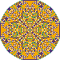

# Sandpile Simulation Project

This project implements a simplified version of the [Abelian sandpile model](https://en.wikipedia.org/wiki/Abelian_sandpile_model). It simulates the dynamics of a sandpile based on an initial configuration provided in a TSV file and generates images in BMP format to visually represent the state of the model over time.

## Project Overview

The application reads an initial configuration from a TSV file, where each line specifies the x and y coordinates and the number of grains at that cell. The grid dimensions are automatically calculated as the minimal rectangle that contains all the specified cells. The simulation evolves by redistributing grains according to the sandpile rules, and if grains exceed the capacity of a cell (4 or more), they "topple" into adjacent cells. The grid dynamically expands if grains flow beyond its current boundaries.

During the simulation, the application periodically saves the current state as a BMP image. Each pixel in the generated image corresponds to a cell in the grid and is colored based on the number of grains:
- **0 grains:** white
- **1 grain:** green
- **2 grains:** purple
- **3 grains:** yellow
- **More than 3 grains:** black

The BMP images are constructed manually, ensuring that the encoding of a single pixel occupies no more than 4 bits.

## Key Features

- **Custom Implementation:** The project is entirely self-contained and does not use any external libraries beyond the standard library.
- **Manual Memory Management:** All memory operations are handled manually, with custom implementations for dynamic memory allocation and deallocation.
- **Dynamic Grid Resizing:** The grid automatically adjusts its size if the sandpile expands beyond its initial boundaries.
- **Command Line Interface:** The application supports command line arguments to specify:
  - **-i, --input**: TSV file containing the initial state.
  - **-o, --output**: Output directory or file name for saving BMP images.
  - **-m, --max-iter**: Maximum number of iterations to simulate.
  - **-f, --freq**: Frequency at which the BMP images are saved (if set to 0, only the final state is saved).

## How It Works

1. **Initialization:** The program begins by reading the initial configuration from a TSV file. The file is expected to list the coordinates and the number of grains for non-empty cells.
2. **Simulation:** The sandpile simulation proceeds in iterations. In each iteration, cells that contain 4 or more grains redistribute their excess grains to adjacent cells. The process continues until the system reaches a stable state or the maximum number of iterations is reached.
3. **Image Generation:** At specified intervals (or just once if no frequency is provided), the current state of the grid is saved as a BMP image. The image is generated by mapping each cell to a pixel with a color based on the number of grains it contains.
4. **Grid Expansion:** If the sandpile grows beyond the current grid limits, the grid is dynamically reallocated with a larger size to accommodate the extra grains.

## Example Usage

Suppose you want to simulate a sandpile with 10000 grains placed at the coordinate (0, 0). First, create a TSV file in data folder (for example, `input.tsv`) with the following content:

0 0 10000

Then run the application with the following command:

./sandpile -i input.tsv -o output.bmp

After the simulation completes, the generated BMP images will be saved in the specified output directory. The image below shows a sample output with 10000 grains at the origin:

## Project Structure

- **getdata.cpp / getdata.h:** Handles reading and parsing the initial TSV input file.
- **parser.cpp / parser.h:** Parses command line arguments.
- **sandpile.cpp / sandpile.h:** Contains the logic for simulating the sandpile model, including cell toppling and dynamic grid resizing.
- **imagegenerator.cpp / imagegenerator.h:** Implements the BMP image generation based on the current state of the sandpile.
- **main.cpp:** The entry point of the application, which ties all the components together.

## License

MIT License
